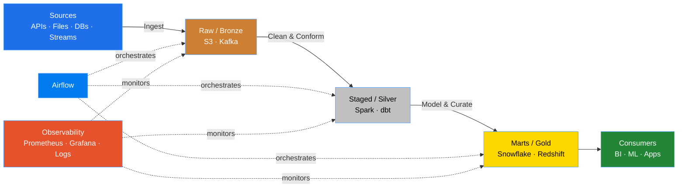

<div align="center">

<!-- Banner -->


<!-- Typing intro -->
<a href="https://github.com/FroCode">
  
</a>

<br/>

<!-- Profile views & followers -->


<br/><br/>

<!-- Contact badges -->
[](mailto:frocodeof@gmail.com)
[](https://www.linkedin.com/in/frocode/)
[](https://github.com/FroCode)

</div>

<!-- Quick Nav -->
<div align="center">

[About](#-about-me) ・ [Stack](#-tech-stack) ・ [Projects](#-featured-projects) ・ [Architecture](#-how-i-build) ・ [Stats](#-github-analytics) ・ [Contact](#-lets-connect)

</div>

---

## +7 years of experiance

> *Data Engineer focused on **scalable pipelines**, **cloud infrastructure**, and **reliable analytics delivery**.*

I design and ship **production-style data platforms** — both **batch** and **streaming** — on **AWS**, with **Python**, **SQL**, **Airflow**, **Kafka**, and **Spark**. From raw ingestion to curated marts, I care deeply about **modular ETL**, **orchestration**, **data quality**, and **ops-ready** deployments (Docker, CI/CD, observability).

```yaml

focus:       [ELT, Streaming, Cloud Data Platforms]
stack:       [Python, SQL, AWS, Airflow, Kafka, Spark, dbt, Docker]
```

<table>
<tr>
<td width="50%" valign="top">

### What I bring
- **ETL & Orchestration** — Airflow DAGs, idempotent staged loads
- **AWS Data Stack** — S3, Glue, Lambda, Athena, Redshift Spectrum
- **Real-Time Systems** — Kafka, Spark Streaming, end-to-end pipelines
- **Engineering Discipline** — Docker, Terraform, CI/CD, Prometheus + Grafana

</td>
<td width="50%" valign="top">

### How I work
- **Modular by default** — small, testable, composable units
- **Observable** — metrics, structured logs, alerts, lineage
- **Cost-aware** — partitioning, file formats, right-sized compute
- **Reproducible** — IaC, versioned configs, containerized runs

</td>
</tr>
</table>

---

## Tech Stack

<div align="center">

### Languages


### Data Engineering


### Cloud & DevOps


### Databases & Storage


### ML & Monitoring


</div>

---

## Featured Projects

<table>
<tr>
<td width="50%" valign="top">

### [AWS-ETL](https://github.com/FroCode/AWS-ETL)
> Cloud-native ETL pipelines on AWS — ingestion, transformation, and curated outputs.

`Python` `AWS` `S3` `Glue`

</td>
<td width="50%" valign="top">

### [news-Data-Pipeline_Airflow_AWS](https://github.com/FroCode/news-Data-Pipeline_Airflow_AWS)
> Orchestrated news ingestion → enrichment → analytics with Airflow on AWS.

`Airflow` `Python` `AWS`

</td>
</tr>
<tr>
<td width="50%" valign="top">

### [Real_Streaming_Kafka](https://github.com/FroCode/Real_Streaming_Kafka)
> Real-time event streaming with Kafka — producers, consumers, and downstream sinks.

`Kafka` `Python` `Streaming`

</td>
<td width="50%" valign="top">

### [City_End_to_End_RealTime](https://github.com/FroCode/City_End_to_End_RealTime)
> End-to-end city data platform: ingest → stream → process → visualize.

`Python` `Kafka` `Real-time E2E`

</td>
</tr>
<tr>
<td width="50%" valign="top">

### [Reddit_ETL](https://github.com/FroCode/Reddit_ETL)
> API → warehouse pipeline pulling Reddit data into structured analytics layers.

`Python` `API` `Warehouse`

</td>
<td width="50%" valign="top">

### [TECHNICAL-TASK-YASA-1-LLC](https://github.com/FroCode/TECHNICAL-TASK-YASA-1-LLC)
> Notebook-driven analysis & data engineering technical task.

`Jupyter` `Python` `Analysis`

</td>
</tr>
</table>

<div align="center">

[](https://github.com/FroCode?tab=repositories)

</div>

---

## How I Build



---

## GitHub Analytics

<div align="center">

<!-- Profile summary + Stats (reliable endpoints) -->
<a href="https://github.com/FroCode">
  
</a>
<a href="https://github.com/FroCode">
  
</a>

<br/>

<!-- Top languages (reliable endpoints) -->
<a href="https://github.com/FroCode">
  
</a>
<a href="https://github.com/FroCode">
  
</a>

<br/>

<!-- Streak + Productive time -->
<a href="https://github.com/FroCode">
  
</a>
<a href="https://github.com/FroCode">
  
</a>

<br/><br/>


<br/><br/>


</div>

---

## Let's Connect

<div align="center">

> **310+** contributions last year · actively shipping pipeline & platform work

<br/>

[](mailto:frocodeof@gmail.com)
[](https://www.linkedin.com/in/frocode/)
[](https://github.com/FroCode)

<br/>

*Open to **Data Engineering**, **Streaming**, and **Cloud Pipeline** opportunities.*

<br/>


</div>
